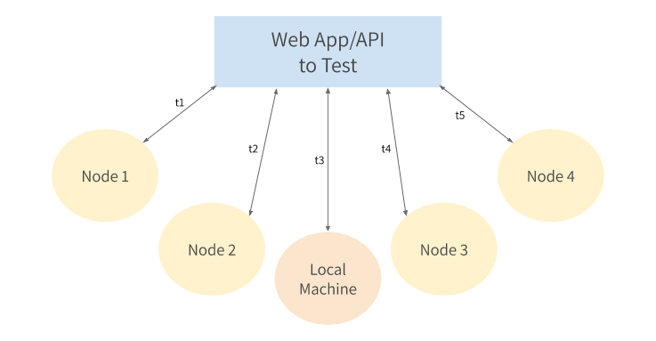

# Response Timer
A Docker image to help you get a nicely formatted result for the response time of a website or API. ⏲

## Why?
[I write a lot of technical blog posts](https://www.karllhughes.com/writing/), and I often want to compare the response times of different hosting providers from various locations around the world. I sometimes use [Pingdom](https://tools.pingdom.com/) for these tests, but it doesn't support request bodies, headers, or different methods (POST, PUT, etc.). Plus, they throttle your usage, so it's not great if you want to run a lot of tests.

After searching for how I could accomplish this with curl, I found [this answer on Stack Overflow](https://stackoverflow.com/a/22625150/977192). This was good, but I wanted to simplify it and put it in a ready-to-deploy Docker image so I could quickly run it on any host that will run a container. 🐳

The goal of this project is to be able to quickly run the script from several nodes (and my local machine) to determine how quickly the API or website will respond from each of them.



## Local Usage

Pull the latest version from Docker Hub: 

```bash
docker pull draftdev/rt
```

A simple GET request:

```bash
docker run --rm draftdev/rt jsonplaceholder.typicode.com/posts
# Response
          final_url:  http://jsonplaceholder.typicode.com/posts
      response_code:  200s
    time_namelookup:  0.025098s
       time_connect:  0.042070s
    time_appconnect:  0.000000s
   time_pretransfer:  0.042265s
      time_redirect:  0.000000s
 time_starttransfer:  0.091801s
                    ----------
         time_total:  0.098020s
```

A more complex POST request (you can use [any of the args that curl supports](https://curl.haxx.se/docs/manpage.html)): 

```bash
docker run --rm draftdev/rt jsonplaceholder.typicode.com/posts -H 'Content-Type: application/json' -d '{"title": "Another great post"}' -X POST
# Response
          final_url:  http://jsonplaceholder.typicode.com/posts
      response_code:  201s
    time_namelookup:  0.014518s
       time_connect:  0.029930s
    time_appconnect:  0.000000s
   time_pretransfer:  0.029982s
      time_redirect:  0.000000s
 time_starttransfer:  0.143273s
                    ----------
         time_total:  0.143517s
```

## Deploying to Various Hosting Providers

### DigitalOcean

![hosting-do.png]

- Log in and [create a new Droplet](https://cloud.digitalocean.com/droplets/new).
- Select the Docker Marketplace image
- Select the smallest ($5/mo) droplet
- Select a single region
- Add your SSH key
- Hit deploy

Once deployed, you can run this container via SSH:

```bash
ssh root@<YOUR_DROPLET_IP> "docker run --rm draftdev/rt jsonplaceholder.typicode.com/posts -H 'Content-Type: application/json' -d '{\"title\": \"Another great post\"}' -X POST"
# Response
          final_url:  http://jsonplaceholder.typicode.com/posts
      response_code:  201s
    time_namelookup:  0.001051s
       time_connect:  0.004071s
    time_appconnect:  0.000000s
   time_pretransfer:  0.004155s
      time_redirect:  0.000000s
 time_starttransfer:  0.046294s
                    ----------
         time_total:  0.046395s
```

Repeat the droplet creation process in each region you want to test your app from, or [migrate the droplet using a snapshot](https://www.digitalocean.com/docs/images/snapshots/how-to/migrate-droplets/).

### Fly.io
Coming soon.

### AWS Lambda
Coming soon.

## Contributing
Improvements are welcome, but please use the [Issues](https://github.com/draftdev/response-timer/issues) to discuss them first. This is a simple script, so I don't envision bundling much more functionality into it.

## License

[MIT License](https://opensource.org/licenses/MIT)

> Copyright 2020, Draft.dev
  
> Permission is hereby granted, free of charge, to any person obtaining a copy of this software and associated documentation files (the "Software"), to deal in the Software without restriction, including without limitation the rights to use, copy, modify, merge, publish, distribute, sublicense, and/or sell copies of the Software, and to permit persons to whom the Software is furnished to do so, subject to the following conditions:
  
> The above copyright notice and this permission notice shall be included in all copies or substantial portions of the Software.
  
> THE SOFTWARE IS PROVIDED "AS IS", WITHOUT WARRANTY OF ANY KIND, EXPRESS OR IMPLIED, INCLUDING BUT NOT LIMITED TO THE WARRANTIES OF MERCHANTABILITY, FITNESS FOR A PARTICULAR PURPOSE AND NONINFRINGEMENT. IN NO EVENT SHALL THE AUTHORS OR COPYRIGHT HOLDERS BE LIABLE FOR ANY CLAIM, DAMAGES OR OTHER LIABILITY, WHETHER IN AN ACTION OF CONTRACT, TORT OR OTHERWISE, ARISING FROM, OUT OF OR IN CONNECTION WITH THE SOFTWARE OR THE USE OR OTHER DEALINGS IN THE SOFTWARE.
